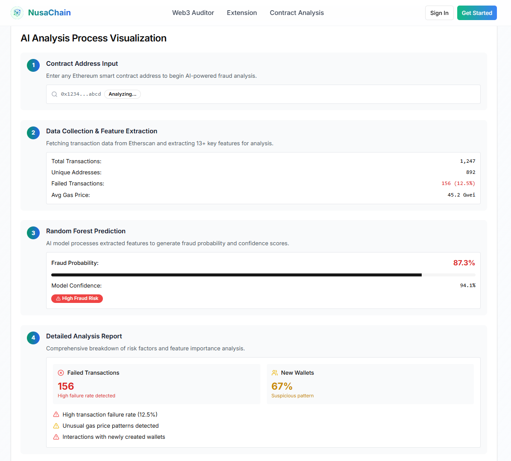

# NusaChain: AI-Powered Web3 Security Ecosystem

<p align="center">
  
</p>

<p align="center">
  <strong>A comprehensive Web3 security suite protecting users through advanced auditing, real-time threat detection, and AI-powered smart contract fraud analysis.</strong>
</p>

<p align="center">
  <a href="#-core-features">Features</a> •
  <a href="#-how-it-works">How It Works</a> •
  <a href="#-technology-stack">Tech Stack</a> •
  <a href="#-getting-started">Getting Started</a> •
  <a href="#-license">License</a>
</p>

---

## 🛡️ About The Project

The Web3 space, while innovative, is fraught with risks like phishing, scams, and malicious smart contracts that can lead to significant financial loss. NusaChain is an all-in-one security ecosystem designed to provide a robust, multi-layered defense for users navigating the decentralized web.

Our mission is to make Web3 safer for everyone by combining proactive website auditing, real-time browser protection, and cutting-edge AI analysis to detect and neutralize threats before they can cause harm.

## ✨ Core Features

NusaChain provides a **Three-Layer Security Protection** model to ensure comprehensive safety.

### 1. 🔍 Web3 Security Auditor

A proactive analysis tool that scans dApp websites for potential threats before you connect your wallet.

- **Frontend Analysis:** Automatically discovers wallet connection buttons and transaction triggers on a website.
- **Transaction Simulation:** Performs a safe, sandboxed simulation of discovered transactions to analyze their potential financial impact without risking your actual assets.
- **Threat Detection:** Identifies potential wallet drainers and other malicious scripts, providing a clear security report and actionable recommendations.

### 2. 🧠 AI-Powered Smart Contract Analysis

Our flagship feature utilizes a sophisticated Machine Learning model to assess the risk level of any Ethereum smart contract.

- **High-Accuracy Detection:** Employs a Random Forest algorithm, achieving over 95% accuracy in detecting fraudulent contracts by analyzing behavioral patterns.
- **In-Depth Data Analysis:** Fetches and analyzes over 13 key features from the blockchain, including transaction patterns, gas usage, contract creation history, and interactions with other addresses.
- **Clear Risk Scoring:** Generates an easy-to-understand fraud probability score and a detailed report explaining the risk factors, enabling users to make informed decisions.

### 3. 🌐 Browser Extension

A real-time security companion that integrates seamlessly into your browsing experience.

- **Real-Time Interception:** Actively scans sites and intercepts transaction requests, warning you of potential threats before you sign a malicious transaction.
- **Human-Readable Warnings:** Translates complex transaction data into simple, understandable alerts.
- **One-Click Analysis:** Provides instant access to the Web3 Auditor and AI Contract Analysis for any site or contract you interact with.

---

## ⚙️ How It Works

NusaChain's power lies in its detailed and transparent analysis processes.

### Audit Process Visualization

The Web3 Auditor follows a clear four-step process to assess a website's security.

<p align="center">
  
  <i>Web3 Auditor Flow</i>
</p>

<p align="center">
  
  <i>Web3 Auditor Demo</i>
</p>

### AI Analysis Process Visualization

Our AI model provides a data-driven fraud probability score based on comprehensive on-chain analysis.

<p align="center">
  
  <i>Smart Contract Address Flow</i>
</p>

<p align="center">
  
  <i>Smart Contract Address Demo</i>
</p>

### Extension Web3 Checker

The Browser Extension provides real-time security warnings for any website or contract you interact with.

<p align="center">
  
  <i>Extension Demo</i>
</p>

---

## 🛠️ Technology Stack

NusaChain is built with a modern, robust technology stack to deliver reliable and scalable performance.

- **Fullstack:** React, Next.js, Tailwind CSS, Python (AI/ML)
- **Blockchain Interaction:** Etherscane, Alchemy, RedHat
- **Database:** Firebase Firestore
- **Deployment:** Vercel

---

## 🚀 Getting Started

To get a local copy up and running, follow these simple steps.

### Prerequisites

- Node.js (v18 or later)
- Python (v3.9 or later)
- npm or yarn

### Installation

1.  **Clone the repository**
    ```sh
    git clone https://github.com/kimchiigu/NusaChain-Web.git
    ```
2.  **Install Frontend Dependencies**
    ```sh
    cd nusachain-web
    npm install
    ```
5.  **Set up Environment Variables**
    - Create a `.env.local` file
    - Add the necessary API keys (e.g., Etherscan, Infura/Alchemy).
      ```
        # Firebase Configuration
        NEXT_PUBLIC_FIREBASE_API_KEY=your_firebase_api_key_here
        NEXT_PUBLIC_FIREBASE_AUTH_DOMAIN=your_project.firebaseapp.com
        NEXT_PUBLIC_FIREBASE_PROJECT_ID=your_project_id
        NEXT_PUBLIC_FIREBASE_STORAGE_BUCKET=your_project.appspot.com
        NEXT_PUBLIC_FIREBASE_MESSAGING_SENDER_ID=123456789
        NEXT_PUBLIC_FIREBASE_APP_ID=1:123456789:web:abcdef123456
        NEXT_PUBLIC_FIREBASE_MEASUREMENT_ID=G-ABCDEF1234

        # Azure AI Configuration
        AZURE_OPENAI_API_KEY=your_azure_openai_api_key
        AZURE_OPENAI_ENDPOINT=https://your-resource.openai.azure.com/
        AZURE_OPENAI_API_VERSION=2025-01-01-preview
        AZURE_OPENAI_DEPLOYMENT_NAME=your_deployment_name

        # Etherscan API
        NEXT_PUBLIC_ETHERSCAN_API_KEY=your_etherscan_api_key_here

        # Network RPC URLs for Hardhat Integration
        MAINNET_RPC_URL_1=https://mainnet.infura.io/v3/your_infura_key
        MAINNET_RPC_URL_137=https://polygon-mainnet.infura.io/v3/your_infura_key
        MAINNET_RPC_URL_42161=https://arbitrum-mainnet.infura.io/v3/your_infura_key
        MAINNET_RPC_URL_11155111=https://sepolia.infura.io/v3/your_infura_key

        # Auditor API Server
        NEXT_PUBLIC_AUDITOR_API_URL=http://localhost:3001

        # Application Settings
        NEXT_PUBLIC_APP_NAME=NusaChain Security Ecosystem
        NEXT_PUBLIC_APP_VERSION=1.0.0
      ```

### Running the Application

1.  **Start the Next.JS Development Server**
    ```sh
    npm run dev
    ```
2.  Open [http://localhost:3000](http://localhost:3000) with your browser to see the result.

---

## 📄 License

Distributed under the MIT License. See `LICENSE` for more information.

---

## 📞 Contact

Christopher Hardy Gunawan - christopher.hygunawan@gmail.com

Project Link: https://nusa-chain-web.vercel.app/
